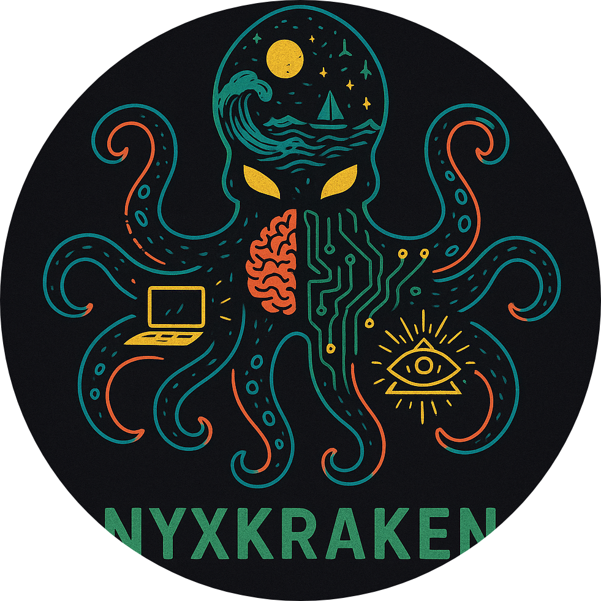

# 🛡️ AETHERIS<br>
**Aetheris** es una herramienta de análisis y escaneo de vulnerabilidades que combina Nmap, correlación con bases de datos CVE, generación de reportes y detección inteligente de IPs públicas.<br>
Diseñada para pentesters, investigadores y entornos defensivos.<br>

---

## 🚀 Características<br>

- ✴️ Escaneo completo con Nmap (`-sV -O`) y exportación XML.<br>
- 🧠 Correlación automática con CVEs (formato enriquecido en `.txt` y `.html`).<br>
- 📊 Reportes claros, con resumen por IP y puertos abiertos.<br>
- 🌐 Advertencia en caso de escanear una IP pública.<br>
- ⚙️ Configuración totalmente editable mediante `aetheris.conf`.<br>
- 🧪 Tests automatizados con `pytest`.<br>

---

## 📂 Estructura del Proyecto<br>

```text
AETHERIS_FULL/
├── aetheris_main.py
├── analizar_vs_scan.py
├── current_cves.py
├── update_cves.py
├── README.md
├── requirements.txt
├── config/
│   ├── aetheris.conf
│   ├── exploitable_types.txt
│   └── keywords.txt
├── cache/
│   ├── cves_cache.json
│   └── exploit_cache.json
├── data/
│   └── aliases.json
├── docs/
│   ├── config_guide.md
│   ├── how_to_integrate_apis.md
│   └── report_interpretation.md
├── integrations/
│   ├── exploitdb_lookup.py
│   ├── nuclei_runner.py
│   ├── nvd_api.py
│   └── vulners_api.py
├── lib/
│   ├── utils.py
│   ├── cve_matcher.py
│   ├── nmap_parser.py
│   ├── nmap_scanner.py
│   └── report_generator.py
├── results/
│   └── templates/
│       ├── reporte_base.txt
│       └── reporte_html.html
├── logs/
│   ├── error.log
│   ├── scan.log
│   └── update.log
└── test/
    ├── test_utils.py
```

---

## ⚙️ Configuración: `config/aetheris.conf`<br>

```ini
[GLOBAL]
results_directory = results
cve_database_path = cve_data/cves_actuales.txt
log_level = INFO
log_file_path = logs/aetheris.log

[NMAP]
default_scan_options = -sV -O -Pn --max-retries 2 --host-timeout 30m
```

---

## 🛠️ Instalación<br>

1. Clona el repositorio:<br>

```bash
git clone https://github.com/tu_usuario/aetheris.git
cd aetheris
```

2. Instala los requisitos:<br>

```bash
pip install -r requirements.txt
```

---

## ✅ Requisitos<br>

- Python 3.9+<br>
- Nmap instalado y accesible desde el sistema (`nmap -v`)<br>
- Acceso a internet para descargar CVEs<br>

---

## ⚡ Uso<br>

```bash
python aetheris_main.py
```

Menú interactivo con:<br>
- Escaneo y análisis<br>
- Actualización de CVEs<br>
- Historial de escaneos<br>

---

## 💡 Preguntas Frecuentes<br>

### ❓ “No se encuentra 'nmap'”<br>
Verifica que esté instalado y accesible desde la terminal:<br>
```bash
nmap -v
```

### ❓ “Advertencia de IP pública”<br>
La herramienta advierte antes de escanear direcciones públicas por razones éticas y legales.<br>

### ❓ “Errores en VS Code con Pylance”<br>
Instala las dependencias:<br>
```bash
pip install -r requirements.txt
```

---

## 🧭 Roadmap (Próximas Funciones)<br>

- [ ] Modo simulación (sin ejecutar Nmap, usando XML de prueba)<br>
- [ ] Soporte para Masscan<br>
- [ ] Exportación JSON / SQLite<br>
- [ ] Módulo de análisis de riesgo (por criticidad)<br>
- [ ] Integración con APIs de exploits (ExploitDB, Vulners)<br>

---

## 🤝 Contribuciones<br>

¡Contribuciones, ideas y mejoras son bienvenidas!<br>

1. Haz un fork<br>
2. Crea una rama (`git checkout -b feature/nueva-funcion`)<br>
3. Haz commit (`git commit -m 'Agrega nueva función'`)<br>
4. Push (`git push origin feature/nueva-funcion`)<br>
5. Abre un Pull Request<br>

---

<br><br>

---

<p align="center">
  
</p>

---

## 🧠 Autor<br>

**NyxKraken**<br>
Creador de AETHERIS, investigador en ciberseguridad y arquitecto de SYNAPSE-OS.<br>

---

## ⚠️ Disclaimer<br>

Esta herramienta fue creada con fines educativos y defensivos.<br>
**No escanees infraestructuras sin permiso explícito.**<br>

:: Powered by AMADEUS // Operated by NyxKraken ::
